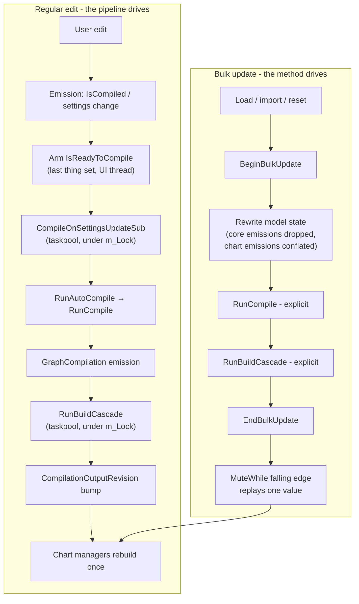

# Reactive update architecture

This document describes how project state changes propagate through the application: the reactive compile pipeline, bulk updates, the suppression mechanisms (`IsBulkUpdating`, `MuteWhile`), and the threading rules that keep the whole thing deadlock-free. It reflects the substantial UI/threading rework carried out after v0.9.3 and is written against the code as of August 2026.

> **Transparency note:** many of the refinements documented here - the bulk-update gating, `MuteWhile`, the threading discipline, the performance rework they emerged from, and this document itself - were developed with the help of Claude AI (Anthropic), working alongside the maintainer.

Everything described here centres on [`CoreViewModel`](src/Zametek.ViewModel.ProjectPlan/CoreViewModel.cs), the hub that owns the project model, and the manager view models (Gantt, resource, earned-value and scenario charts, arrow/vertex graphs, tracking, output, metrics) that hang off it.

---

## 1. The moving parts

- **`CoreViewModel`** owns the editable state (activities, resource / work stream / graph / holiday settings, project start, today), the compiler (`m_VertexGraphCompiler`), the compilation result (`GraphCompilation`), and the derived outputs: `ArrowGraph`, `VertexGraph`, `ResourceSeriesSet`, `TrackingSeriesSet` and the metrics. All mutation of that state is serialized on a single private lock, `m_Lock`.
- **Manager view models** subscribe to `CoreViewModel` properties with ReactiveUI `WhenAnyValue` chains and rebuild their own outputs (plots, graphs, grids) when inputs change. Each one implements `IKillSubscriptions.KillSubscriptions()` to dispose its pipeline.
- **Schedulers.** Heavy work (compiles, Build\* methods, chart plot builds) runs on `RxSchedulers.TaskpoolScheduler`; only UI delivery uses `RxSchedulers.MainThreadScheduler`. ReactiveUI 24 models the main thread as an `ISequencer` rather than an Rx `IScheduler`; the repo-scoped `ObserveOn(ISequencer)` bridge in [`ObservableExtensions`](src/Zametek.ViewModel.ProjectPlan/Miscellaneous/ObservableExtensions.cs) exists because importing `ReactiveUI.Primitives` wholesale would make every core Rx operator call ambiguous (it redeclares `Select`, `Where`, `Subscribe`, ...).

## 2. Emissions: what they are, and *when* they happen

An **emission** is a value being pushed through an observable pipeline. In this codebase they come from two sources:

1. **Property change notifications.** When a view model property raises `RaisePropertyChanged`, every `WhenAnyValue` chain watching it re-reads the property getter **synchronously, on the thread that raised the change**, and pushes the value down its pipeline. This is why the raising thread matters, and why some getters must be lock-free (see §7).
2. **DynamicData changesets.** The activity collection is observed via `ToObservableChangeSet()`; `AutoRefresh(activity => activity.IsCompiled)` additionally emits a *Refresh* change whenever that one property changes on any activity. The uncompiled-activities watcher in `CoreViewModel` is built this way.

The single most important distinction in the whole design is **emission time versus delivery time**:

- Operators placed **before** `ObserveOn(...)` run at *emission time* - synchronously, on the thread that pushed the value, at the moment the state change happened.
- The subscriber callback (and anything after `ObserveOn`) runs at *delivery time* - later, on the scheduler's thread, when the world may already have moved on.

Two standing consequences:

- **Gates must sit before `ObserveOn`.** A suppression check such as `.Where(_ => !IsBulkUpdating)` or `.MuteWhile(...)` asks "is a bulk update in progress *right now*?" - a question only meaningful at emission time. If the check ran at delivery time, the deferred taskpool invocation would often execute after the bulk update window had already closed, see a `false` flag, and let a stale trigger through.
- **Handlers must re-read live state.** A delivered payload is a snapshot from its emission time and may be stale. The Build\* handlers therefore treat the payload as a *trigger*, not as data: they take `m_Lock` and read current state. The uncompiled-activities subscriber is the canonical example - its changeset says "something became uncompiled", but by delivery time a load may already have compiled everything, so the handler re-checks `RawActivities.Any(a => !a.IsCompiled)` before arming a compile (a redundant compile would wrongly mark the scenario as modified).

## 3. The regular (reactive) compile path

This is the steady-state flow for a **single edit** - the user changes an activity's duration, adds a dependency, edits a resource setting:

1. The edit marks activities uncompiled / raises a settings property.
2. The uncompiled-activities watcher (`m_AreActivitiesUncompiledSub`) or a settings applier arms the trigger: it first raises `IsReadyToReviseTrackers` (tracker revisions run *inline* during that raise), then sets `IsReadyToCompile = ReadyToCompile.Yes`. `IsReadyToCompile` is deliberately **the last thing set** by every arm site, and it is an enum rather than a bool because repeated `true` assignments would not re-raise (ReactiveUI issue #3846).
3. `m_CompileOnSettingsUpdateSub` observes `IsReadyToCompile` and hops to the taskpool - arming happens on the UI thread, but **the compile must never run there**. Under `m_Lock` it calls `RunAutoCompile()`, which runs `RunCompile()` only if `AutoCompile` is enabled.
4. `RunCompile()` (under `m_Lock`, wrapped in `BeginBusy`/`EndBusy`) feeds resources and work streams to the vertex-graph compiler, then assigns the result to `GraphCompilation`. It also sets `IsProjectScenarioUpdated`, clears `HasStaleOutputs`, and disarms both triggers.
5. The `GraphCompilation` change emission reaches `m_BuildCascadeSub`, which (on the taskpool) calls `RunBuildCascade()`: the seven Build\* methods in dependency order - `BuildArrowGraph` → `BuildVertexGraph` → `BuildResourceSeriesSet` → `BuildTrackingSeriesSet` → `BuildNetworkMetrics` → `BuildRiskMetrics` → `BuildFinancialMetrics` - followed by a bump of `CompilationOutputRevision`, the settled signal (§9).
6. Chart manager view models keyed on `CompilationOutputRevision` rebuild their plots, on the taskpool, once.

Net result: **one edit, one compile, one cascade, one rebuild per chart.**

One deliberate exception: risk metrics have a non-compile trigger. `m_BuildRiskMetricsSub` watches `GraphSettings` directly, because activity-severity settings feed the risk metrics without requiring a recompile.

## 4. Bulk updates

A **bulk update** is one logical operation that rewrites large parts of the model in sequence. There are three entry points, all in `CoreViewModel`:

- `ResetProjectScenario()` - clear everything back to an empty scenario;
- `ProcessProjectScenario(...)` - load a scenario (also the funnel for every scenario switch, and it logs which scenario is in play);
- `ProcessProjectScenarioImport(...)` - import from MS Project / Excel.

Each of these assigns *dozens* of properties: project start, today, display / holiday / work-stream / resource / graph settings, graph layouts, then the entire activity list. If the reactive pipeline stayed live, every intermediate assignment would be a trigger: multiple redundant compiles, cascades running against half-populated state (activities present before their resource settings, or vice versa), and spurious "scenario modified" flags.

The mechanism:

```csharp
try
{
    BeginBulkUpdate();
    lock (m_Lock)
    {
        BeginBusy();
        // ... rewrite the model: settings, layouts, activities ...

        RunCompile();

        // The internal Build* subscriptions drop their emissions during a
        // bulk update, so run the cascade actively while everything is
        // still muted.
        RunBuildCascade();
    }
}
finally
{
    EndBusy();
    EndBulkUpdate();
}
```

Key properties of the mechanism:

- **`IsBulkUpdating` is a ref-counted gate.** `BeginBulkUpdate()` / `EndBulkUpdate()` use an `Interlocked` nesting counter and raise the property change only on the outermost transitions. Nesting is routine: `ProcessProjectScenario` calls `ResetProjectScenario` inside its own bulk window, so both frames hold the gate. Always pair Begin/End in a `try`/`finally`.
- **The core subscriptions drop their emissions** while the gate is up, via `.Where(_ => !IsBulkUpdating)` placed before `ObserveOn` (emission-time check, §2). Dropping is correct - not conflating - because the bulk method itself takes over the pipeline's job.
- **The bulk method drives explicitly.** Once *all* state is in place it calls `RunCompile()` then `RunBuildCascade()` directly, inside the still-muted window. Exactly one compile and one cascade run, at the single moment when every input is consistent. (`ResetProjectScenario` is the exception: it does not compile - it assigns a fresh empty `GraphCompilation` and clears each output directly.)

Contrast of the two modes:

| | Regular compile | Bulk update |
|---|---|---|
| Trigger | One edit | Load / import / reset |
| Who drives | The reactive pipeline | The bulk method, imperatively |
| Pipeline state | Live | Muted (`IsBulkUpdating`) |
| Compile | `RunAutoCompile` via subscription | `RunCompile()` called explicitly |
| Cascade | `m_BuildCascadeSub` via subscription | `RunBuildCascade()` called explicitly |
| Chart rebuilds | One per settled signal | One, replayed at `EndBulkUpdate` |



## 5. Drop versus conflate: two suppression strategies

The two sides of the `IsBulkUpdating` gate suppress differently, and the difference matches their responsibilities:

- **Core-internal subscriptions DROP** (`.Where(_ => !IsBulkUpdating)`). Their emissions during a bulk update are *redundant*: the bulk method runs the compile and the cascade itself, so nothing is lost by discarding them.
- **Manager view models CONFLATE** (`.MuteWhile(...)`). Nobody rebuilds a Gantt plot on the chart VM's behalf - if its triggers were silently dropped, the chart would still show the previous project after a load. So the muted emissions are conflated to one remembered value that is replayed when the gate falls, producing exactly one rebuild at the end.

Rule of thumb when adding a new subscription: if the bulk update methods already produce your output for you, drop; if you are the only producer of your output, conflate with `MuteWhile`.

## 6. `MuteWhile`: what it is and how it works

`MuteWhile` (in [`ObservableExtensions`](src/Zametek.ViewModel.ProjectPlan/Miscellaneous/ObservableExtensions.cs)) is a custom Rx operator: it suppresses a source sequence while the latest value of a boolean gate sequence is `true`, remembering only the most recent suppressed value, and replays that one value when the gate falls back to `false`.

Behaviour by gate state:

- **Gate `false` (unmuted):** every source value is forwarded immediately, on the thread that emitted it.
- **Gate `true` (muted):** source values are swallowed; only the latest is remembered, each new arrival overwriting the last (conflation).
- **Falling edge (`true` → `false`):** if anything arrived while muted, the remembered value is forwarded once, on the thread that changed the gate - this is the single "active trigger" at the end of a bulk update. If nothing arrived, nothing is forwarded.

Implementation details that matter to correctness:

- The gate is piped through `DistinctUntilChanged()` - a gate that re-raises `true` repeatedly must not replay the pending value twice.
- The gate is subscribed **before** the source, so an initial gate value (e.g. a `WhenAnyValue` seed) is in place before the source's first emission; otherwise that first value could slip past a gate that should already be closed.
- Each subscription gets its own private state (`Observable.Create` factory).
- All state transitions happen under a small internal lock, but `observer.OnNext` is **always called outside it** - downstream handlers run arbitrary code and must never execute while the operator's lock is held.
- The replayed value is a snapshot from its original emission time. Downstream handlers must read live state rather than trust the payload (§2) - which the Build\* manager subscriptions do.

Canonical usage (from [`GanttChartManagerViewModel`](src/Zametek.ViewModel.ProjectPlan/GanttChartManagement/GanttChartManagerViewModel.cs)):

```csharp
m_BuildGanttChartPlotModelSub = this
    .WhenAnyValue(
        rcm => rcm.m_CoreViewModel.CompilationOutputRevision,   // settled signal
        rcm => rcm.m_CoreViewModel.ResourceSettings,
        // ... further inputs ...
        (x, ...) => x)
    .MuteWhile(this.WhenAnyValue(rcm => rcm.m_CoreViewModel.IsBulkUpdating))
    .ObserveOn(RxSchedulers.TaskpoolScheduler)
    .Subscribe(async _ => await BuildGanttChartPlotModelAsync());
```

Note the operator order - inputs → `MuteWhile` → `ObserveOn` → handler - and that the mute decision therefore happens at emission time (§2).

## 7. Threading and ordering rules

These rules are load-bearing; several were earned through deadlocks and double-build bugs during the post-v0.9.3 rework.

1. **`m_Lock` serializes model state.** Every mutation of `CoreViewModel` state, every compile, and every Build\* method runs under it.
2. **Compiles and cascades never run on the UI thread.** Arm sites raise triggers wherever they are (often the UI thread); the subscriptions hop to `RxSchedulers.TaskpoolScheduler` before doing work. UI bindings are contending for `m_Lock` at the same time, so nothing avoidable happens inside the locked sections (e.g. `RunCompile` captures values under the lock but logs after releasing it).
3. **Suppression gates sit before `ObserveOn`** so they run at emission time (§2). This applies to both `.Where(_ => !IsBulkUpdating)` and `.MuteWhile(...)`.
4. **`IsBusy` and `IsBulkUpdating` getters are lock-free** (`Volatile.Read` over an `Interlocked` counter). `WhenAnyValue` observers re-read a raised property *synchronously on the raising thread*; if these getters took `m_Lock`, every raise would couple those observers to the lock and invite deadlock.
5. **Never call `BeginBulkUpdate`/`EndBulkUpdate` while holding `m_Lock`.** Raising `IsBulkUpdating` causes its getter to be re-read synchronously by property-chain observers on the raising thread; if that thread held `m_Lock`, it could deadlock against the Build\* subscriptions that serialize on `m_Lock`. This is why the bulk methods call `BeginBulkUpdate()` *before* `lock (m_Lock)` and `EndBulkUpdate()` in the `finally`, after the lock is released.
6. **Never call out to unknown code while holding an internal lock.** `MuteWhile` decides under its lock but forwards (`observer.OnNext`) outside it; `EndBusy` uses a defensive lock-free CAS loop (clamped at zero) rather than a lock at all.
7. **Handlers re-read live state; payloads are stale snapshots** (§2).
8. **Busy/bulk scopes are ref-counted and exception-safe.** `BeginBusy`/`EndBusy` and `BeginBulkUpdate`/`EndBulkUpdate` nest freely (the busy sections routinely call each other) and are always paired through `try`/`finally`, so a throw mid-load cannot leave the UI stuck busy or the pipeline permanently muted.
9. **Property getters that participate in change notification never take application locks.** Rule 4 is the general law, not an `IsBusy` special case, and it was re-earned the hard way: a captured dump (2026-08) showed the UI thread inside a ReactiveUI expression-chain sink - which holds its own internal gate while it re-reads the observed getter by reflection - blocked on `GanttActivitySelectorViewModel`'s `m_Lock`, while the worker holding that lock was raising `PropertyChanged` into the same sink and blocked on its gate: a textbook ABBA deadlock, with the raise-under-lock half supplied invisibly by an `ObservableCollection.CollectionChanged` handler running synchronously inside a locked mutation block. A getter cannot control which locks its readers already hold, so derived values (joined display strings, selected-id lists) are computed under the lock *at write time* and published as immutable snapshots - a plain string, a wholesale-replaced `int[]` - that the getter returns with a lock-free read. See the selector view models' `RefreshDerivedProperties()` (called first in their `Raise*PropertiesChanged()` methods) and the tracker sets' replace-only `m_LastTracker`-style references, whose atomic reference reads need no lock at all. Plain Avalonia bindings, sort comparers and copy-table readers hold no gate and can at worst contend briefly; only a lock-taking getter can complete a deadlock cycle.

## 8. `IsBusy` versus `IsBulkUpdating`

They look similar (both ref-counted, both raised on outermost transitions) but serve different masters, and confusing them causes subtle bugs:

- **`IsBusy` is a UI-facing signal only** - busy indicators, disabled controls. It must **never** gate reactive behaviour; use `IsBulkUpdating` or dedicated flags for that. (Its doc comment in `CoreViewModel` states this contract.)
- **`IsBulkUpdating` is the behavioural gate** described in §4–§5.

The UI consumption of `IsBusy` has its own refinement, in [`MainViewModel`](src/Zametek.ViewModel.ProjectPlan/MainViewModel.cs): the busy overlay is *immediate* for long-form operations (project loads, scenario processing - `IsMainBusy` and the scenario manager's `IsBusy`) but *delayed by 250 ms* for the core compile signal, via a `Timer`/`Switch` pipeline. Quick auto-compiles finish well inside the delay, so an ordinary edit never flips the overlay on and off (which would restyle large parts of the window); clearing is immediate, and rapid busy/idle flips inside the window collapse to no visible change.

## 9. The settled signal: `CompilationOutputRevision`

A compile produces its outputs across seven Build\* steps. A chart that watched, say, `ResourceSeriesSet` *and* `GraphCompilation` would rebuild twice per compile - once per input, possibly seeing mixed generations of state in between. `RunBuildCascade()` therefore bumps `CompilationOutputRevision` (an `int`, incremented modulo a wrap constant) **after all seven outputs are in place**, and chart managers key their rebuild pipelines on that revision instead of on the individual outputs: one compile means exactly one settled raise means exactly one rebuild.

## 10. Maintaining display order: input surfaces versus display-only surfaces

Several panels present rows or sections "in resource order" - the order the user arranged in the Resource Settings grid (drag to reorder; [`UpdateDisplayOrders`](src/Zametek.ViewModel.ProjectPlan/ResourceSettingsManagement/ResourceSettingsManagerViewModel.cs) stamps `DisplayOrder` as a *descending* rank, so the grid's top row holds the highest value). Two different mechanisms keep that order correct, chosen by which side of the compile the surface sits on.

**Input surfaces mirror the live settings collections.** The effort timesheet ([`EffortTrackingManagerViewModel`](src/Zametek.ViewModel.ProjectPlan/TrackingManagement/EffortTrackingManagerViewModel.cs)) renders the live `IManagedResourceViewModel` instances themselves: its sections bind to the same objects the settings grid edits, and there is no compiled snapshot in between. It therefore observes the settings panel's `OrderableResources` (and the core's `OrderableActivities`) through `Observable.FromEventPattern` collection-changed bridges merged into its refresh trigger, and rebuilds its sections the moment a drag lands. One data source, so mirroring its order live is unambiguous; comparing the live *instances* rather than ids in `RefreshTimesheet` also stops the sections driving stale, disposed view models after a scenario switch.

**Display-only surfaces take their order from the cascade.** Compiled outputs - the charts, the Metrics panel, the Resource Metrics panel - are snapshots produced by the Build\* cascade, and their ordering is baked into the rebuilt output itself. The per-resource metrics are the canonical example: `MetricCalculationService.BuildFinancialMetrics` emits the `ResourceMetrics` list already sorted the way the settings grid displays its rows (descending `DisplayOrder`, ties broken by descending resource id, which drops the implicit/spare series to the bottom), so the panel simply renders list order and the persisted scenario stores that same order. No `Orderable*` event bridges, no sibling view-model coupling, and no second source of truth to reconcile.

The reason display-only surfaces must not borrow the input-surface technique is epoch consistency. A compiled snapshot is keyed by the resource ids *as of the last compile*, while the live collections change ids and membership immediately: renumbering rewrites every id at once, and adding or deleting resources creates rows with no snapshot entry (or entries with no row). Joining live order onto snapshot values would tear during every stale window and need last-known-order bookkeeping to avoid transient scrambles. The cascade route sidesteps all of it: a reorder or renumber funnels through `UpdateResourceSettingsToCore()`, the `ResourceSettings` setter arms `IsReadyToCompile`, the auto-compile runs, and the rebuild delivers ids, values and order together, atomically - with `HasStaleOutputs` flagging the gap in between. A pure drag-reorder does trigger a full recompile (the settings record comparison sees the `DisplayOrder` change); that is the existing, accepted cost of keeping everything downstream consistent.

The rule of thumb: **if a surface renders the live settings objects, mirror the `Orderable*` collections; if it renders compiled output, bake the order into the output at build time.**

## 11. The headless CLI: the pattern at its extreme

The `zpp` command-line tool ([`Program`](src/Zametek.ProjectPlan.CommandLine/Program.cs)) is the bulk update idea taken to its logical end. It resolves each view model and immediately calls `KillSubscriptions()` (so no reactive pipeline exists at all), sets `core.AutoCompile = false`, and then drives everything explicitly: `RunCompile()` followed by the Build\* calls in the same dependency order as `RunBuildCascade`. Seams that only the reactive pipeline used to reach must be public for this to work - e.g. `IProjectScenarioManagerViewModel.BuildTrackedMetrics()`, which the GUI invokes via a subscription but the CLI must call directly before building the scenario chart.

## 12. Diagnostics

[`CascadeDiagnostics`](src/Zametek.ViewModel.ProjectPlan/Miscellaneous/CascadeDiagnostics.cs) is a dormant tracing facility left in place from the performance investigation: call sites throughout the cascade record markers, build counts, collection-change notifications and stack traces, but every call is compiled away unless the `CASCADE_DIAGNOSTICS` symbol is defined (instructions are in the class comment; output goes to `Debug.WriteLine` and is mirrored to `zametek-cascade-diagnostics.log` in the user's temp directory, so a Debug build can simply be run - no debugger attached - and the trace collected from the file afterwards). Re-enable it when verifying gating behaviour - e.g. that a load produces exactly one compile and one cascade - or when hunting redundant rebuilds and deadlocks.
