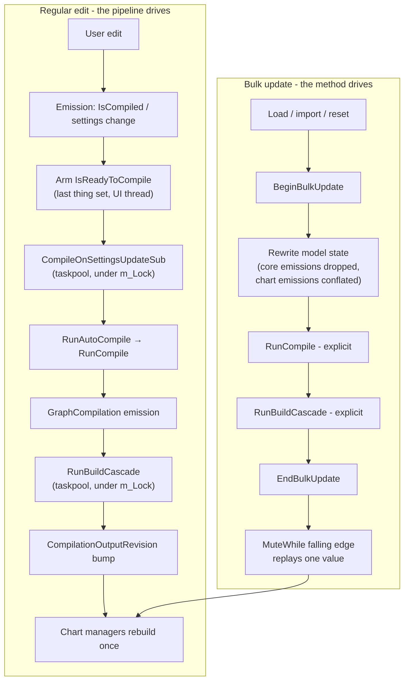

# Reactive update architecture

This document describes how a change of project state moves through the application. It covers the reactive compile pipeline, bulk updates, the suppression mechanisms (`IsBulkUpdating` and `MuteWhile`), and the threading rules that prevent deadlocks. The document reflects the major rework of the UI and the threads after v0.9.3. It describes the source code as of August 2026.

> **Transparency note:** Claude AI (Anthropic) worked alongside the maintainer to develop many of the refinements in this document. These refinements are the bulk-update gating, `MuteWhile`, the threading discipline, and the performance rework that they came from. Claude AI also helped to develop this document itself.

Everything in this document is about [`CoreViewModel`](../src/Zametek.ViewModel.ProjectPlan/CoreViewModel.cs). It is the hub that owns the project model. The manager view models connect to it: the Gantt, resource, earned-value and scenario charts, the arrow and vertex graphs, tracking, output and metrics.

---

## 1. The moving parts

- **`CoreViewModel`** owns the editable state: the activities, the settings for resources, work streams, graphs and holidays, the project start, and today. It also owns the compiler (`m_VertexGraphCompiler`), the compilation result (`GraphCompilation`), and the derived outputs: `ArrowGraph`, `VertexGraph`, `ResourceSeriesSet`, `TrackingSeriesSet` and the metrics. A single private lock, `m_Lock`, makes each change of that state run one at a time.
- **Manager view models** subscribe to properties of `CoreViewModel` with ReactiveUI `WhenAnyValue` chains. When an input changes, they rebuild their own outputs: plots, graphs and grids. Each of them makes its pipeline in `IStartSubscriptions.StartSubscriptions()` and not in its constructor (§7 rule 12). It disposes the pipeline in `IKillSubscriptions.KillSubscriptions()`.
- **Schedulers.** Heavy work runs on `RxSchedulers.TaskpoolScheduler`. Heavy work is compilations, the Build\* methods and the builds of chart plots. Only the delivery to the UI uses `RxSchedulers.MainThreadScheduler`. ReactiveUI 24 models the main thread as an `ISequencer` and not as an Rx `IScheduler`. The bridge `ObserveOn(ISequencer)` in [`ObservableExtensions`](../src/Zametek.ViewModel.ProjectPlan/Miscellaneous/ObservableExtensions.cs) is specific to this repository. It exists because an import of `ReactiveUI.Primitives` as a whole makes each call to a core Rx operator ambiguous. `ReactiveUI.Primitives` declares `Select`, `Where`, `Subscribe` and others again.

## 2. Emissions: what they are, and *when* they happen

An **emission** is a value that moves through an observable pipeline. In this codebase, emissions come from two sources:

1. **Property change notifications.** A view model property raises `RaisePropertyChanged`. Then each `WhenAnyValue` chain that watches the property reads the getter again, **synchronously, on the thread that raised the change**. It sends the value down its pipeline. Thus, the raising thread is important, and some getters must be lock-free (refer to §7).
2. **DynamicData changesets.** The activity collection uses `ToObservableChangeSet()`. `AutoRefresh(activity => activity.IsCompiled)` also emits a *Refresh* change each time that property changes on an activity. The uncompiled-activities watcher in `CoreViewModel` uses this method.

The most important distinction in the design is **emission time versus delivery time**:

- Operators that are **before** `ObserveOn(...)` run at *emission time*. They run synchronously, on the thread that pushed the value, at the moment of the state change.
- The subscriber callback, and each operator after `ObserveOn`, runs at *delivery time*. This is later, on the thread of the scheduler, when the state can already be different.

These two consequences always apply:

- **Gates must be before `ObserveOn`.** A suppression check such as `.Where(_ => !IsBulkUpdating)` or `.MuteWhile(...)` asks the question "Is a bulk update in progress *now*?". This question has a meaning only at emission time. Suppose the check runs at delivery time. Then the deferred taskpool call often runs after the bulk update window closes. It sees a `false` flag, and it lets a stale trigger through.
- **Handlers must read the live state again.** A payload that the pipeline delivers is a snapshot from its emission time, and it can be stale. Thus, the Build\* handlers treat the payload as a *trigger* and not as data. They take `m_Lock` and read the current state. The uncompiled-activities subscriber is the standard example. Its changeset says that something became uncompiled. But a load can compile everything before the delivery. Thus, the handler checks `RawActivities.Any(a => !a.IsCompiled)` again before it arms a compilation. A redundant compilation marks the scenario as modified, and this is wrong.

## 3. The regular (reactive) compile path

This is the steady-state flow for a **single edit**. The user changes the duration of an activity, adds a dependency, or edits a resource setting:

1. The edit marks activities as uncompiled, or it raises a settings property.
2. The uncompiled-activities watcher (`m_AreActivitiesUncompiledSub`) or a settings applier arms the trigger. First, it raises `IsReadyToReviseTrackers`, and the tracker revisions run *inline* during that raise. Then it sets `IsReadyToCompile = ReadyToCompile.Yes`. Each arm site sets `IsReadyToCompile` **last** on purpose. It is an enum and not a bool, because repeated `true` assignments do not raise the property again (ReactiveUI issue #3846).
3. `m_CompileOnSettingsUpdateSub` observes `IsReadyToCompile` and moves to the taskpool. Arming happens on the UI thread, but **the compilation must never run there**. Under `m_Lock`, it calls `RunAutoCompile()`. This method runs `RunCompile()` only if `AutoCompile` is enabled.
4. `RunCompile()` runs under `m_Lock`, between `BeginBusy` and `EndBusy`. It gives the resources and work streams to the vertex-graph compiler, and then it assigns the result to `GraphCompilation`. It also sets `IsProjectScenarioUpdated`, clears `HasStaleOutputs`, and disarms both triggers.
5. The emission of the change of `GraphCompilation` reaches `m_BuildCascadeSub`. On the taskpool, this subscription calls `RunBuildCascade()`. This method calls the seven Build\* methods in dependency order: `BuildArrowGraph` → `BuildVertexGraph` → `BuildResourceSeriesSet` → `BuildTrackingSeriesSet` → `BuildNetworkMetrics` → `BuildRiskMetrics` → `BuildFinancialMetrics`. Then it increments `CompilationOutputRevision`, the settled signal (§9).
6. The chart manager view models that use `CompilationOutputRevision` as their key rebuild their plots one time, on the taskpool.

The net result is **one edit, one compilation, one cascade, and one rebuild for each chart.**

There is one deliberate exception: the risk metrics have a trigger that is not a compilation. `m_BuildRiskMetricsSub` watches `GraphSettings` directly. The reason is that the activity-severity settings go into the risk metrics without a new compilation.

## 4. Bulk updates

A **bulk update** is one logical operation that rewrites large parts of the model in sequence. It has three entry points, all in `CoreViewModel`:

- `ResetProjectScenario()` clears everything back to an empty scenario
- `ProcessProjectScenario(...)` loads a scenario. It is also the single path for each scenario switch, and it logs which scenario is in use
- `ProcessProjectScenarioImport(...)` imports from MS Project or Excel.

Each of these methods assigns *dozens* of properties. These are the project start, today, and the settings for display, holidays, work streams, resources and graphs. They are also the graph layouts, and then the complete list of activities. Suppose the reactive pipeline stays live. Then each intermediate assignment is a trigger.

The results are many redundant compilations, cascades that run against a state that is only partly filled, and false "scenario modified" flags. An example of a partly filled state is activities that exist before their resource settings, or the reverse.

This is the mechanism:

```csharp
try
{
    BeginBulkUpdate();
    lock (m_Lock)
    {
        BeginBusy();
        // ... rewrite the model: settings, layouts, activities ...

        RunCompile();

        // The internal Build* subscriptions drop their emissions during a
        // bulk update, so run the cascade actively while everything is
        // still muted.
        RunBuildCascade();
    }
}
finally
{
    EndBusy();
    EndBulkUpdate();
}
```

These are the key properties of the mechanism:

- **`IsBulkUpdating` is a gate with a counter.** `BeginBulkUpdate()` and `EndBulkUpdate()` use an `Interlocked` nesting counter. They raise the property change only at the outermost transitions. Nesting is usual: `ProcessProjectScenario` calls `ResetProjectScenario` inside its own bulk window, and thus both frames hold the gate. Always use Begin and End as a pair in a `try`/`finally`.
- **The core subscriptions drop their emissions** while the gate is up. They use `.Where(_ => !IsBulkUpdating)`, which is before `ObserveOn` (emission-time check, §2). Dropping is correct, and conflation is not necessary, because the bulk method does the job of the pipeline itself.
- **The bulk method drives the process explicitly.** When *all* state is in place, it calls `RunCompile()` and then `RunBuildCascade()` directly, inside the window that is still muted. Exactly one compilation and one cascade run, at the one moment when each input is consistent. `ResetProjectScenario` is the exception. It does not compile. It assigns a new empty `GraphCompilation` and clears each output directly.

This table compares the two modes:

| | Regular compilation | Bulk update |
|---|---|---|
| Trigger | One edit | A load, an import or a reset |
| Who drives | The reactive pipeline | The bulk method, with explicit calls |
| Pipeline state | Live | Muted (`IsBulkUpdating`) |
| Compilation | `RunAutoCompile` through a subscription | `RunCompile()`, called explicitly |
| Cascade | `m_BuildCascadeSub` through a subscription | `RunBuildCascade()`, called explicitly |
| Chart rebuilds | One for each settled signal | One, replayed at `EndBulkUpdate` |



## 5. Drop versus conflate: two suppression strategies

The two sides of the `IsBulkUpdating` gate suppress in different ways. The difference matches their responsibilities:

- **Core-internal subscriptions DROP** (`.Where(_ => !IsBulkUpdating)`). Their emissions during a bulk update are *redundant*. The bulk method runs the compilation and the cascade itself, and thus the loss of these emissions has no effect.
- **Manager view models CONFLATE** (`.MuteWhile(...)`). Nothing else rebuilds a Gantt plot for the chart view model. Suppose the application drops the triggers of the chart view model silently. Then the chart still shows the previous project after a load. Thus, the pipeline conflates the muted emissions to one remembered value. The pipeline replays this value when the gate falls, and this gives exactly one rebuild at the end.

Use this rule of thumb when you add a new subscription. If the bulk update methods already produce your output for you, drop. If you are the only producer of your output, conflate with `MuteWhile`.

## 6. `MuteWhile`: what it is and how it works

`MuteWhile` (in [`ObservableExtensions`](../src/Zametek.ViewModel.ProjectPlan/Miscellaneous/ObservableExtensions.cs)) is a custom Rx operator. It suppresses a source sequence while the latest value of a boolean gate sequence is `true`. It remembers only the most recent value that it suppressed. It replays that one value when the gate goes back to `false`.

This is the behavior for each state of the gate:

- **Gate `false` (unmuted):** The operator forwards each source value immediately, on the thread that emitted it.
- **Gate `true` (muted):** The operator swallows the source values. It remembers only the latest value, and each new value replaces the last (conflation).
- **Falling edge (`true` → `false`):** If a value arrived during the mute, the operator forwards the remembered value one time, on the thread that changed the gate. This is the single "active trigger" at the end of a bulk update. If no value arrived, the operator forwards nothing.

These implementation details are important for correct operation:

- The operator filters the gate with `DistinctUntilChanged()`. A gate that raises `true` again and again must not replay the pending value two times.
- The operator subscribes to the gate **before** the source. Thus, an initial gate value, for example a `WhenAnyValue` seed, is in place before the first emission of the source. Otherwise, that first value can pass a gate that must already block it.
- Each subscription has its own private state (`Observable.Create` factory).
- All state transitions occur under a small internal lock. But the operator **always calls** `observer.OnNext` **outside the lock**. The downstream handlers run arbitrary logic, and this logic must never run while the operator holds its lock.
- The replayed value is a snapshot from its original emission time. The downstream handlers must read the live state and not trust the payload (§2). The Build\* manager subscriptions do this.

This is the standard usage (from [`GanttChartManagerViewModel`](../src/Zametek.ViewModel.ProjectPlan/GanttChartManagement/GanttChartManagerViewModel.cs)):

```csharp
m_BuildGanttChartPlotModelSub = this
    .WhenAnyValue(
        rcm => rcm.m_CoreViewModel.CompilationOutputRevision,   // settled signal
        rcm => rcm.m_CoreViewModel.ResourceSettings,
        // ... further inputs ...
        (x, ...) => x)
    .MuteWhile(this.WhenAnyValue(rcm => rcm.m_CoreViewModel.IsBulkUpdating))
    .ObserveOn(RxSchedulers.TaskpoolScheduler)
    .Subscribe(async _ => await BuildGanttChartPlotModelAsync());
```

Note the order of the operators: inputs → `MuteWhile` → `ObserveOn` → handler. Thus, the decision to mute occurs at emission time (§2).

## 7. Threading and ordering rules

These rules are important. Several of them came from deadlocks and double-build bugs during the rework after v0.9.3.

1. **`m_Lock` runs the model changes one at a time.** Each mutation of the state of `CoreViewModel`, each compilation and each Build\* method runs under it.
2. **Compilations and cascades never run on the UI thread.** The arm sites raise triggers on any thread, often the UI thread. The subscriptions move to `RxSchedulers.TaskpoolScheduler` before they do work. The UI bindings compete for `m_Lock` at the same time. Thus, nothing that is avoidable occurs inside the locked sections. For example, `RunCompile` captures values under the lock, but it writes the log after it releases the lock.
3. **Suppression gates are before `ObserveOn`**, and thus they run at emission time (§2). This applies to `.Where(_ => !IsBulkUpdating)` and to `.MuteWhile(...)`.
4. **The getters of `IsBusy` and `IsBulkUpdating` are lock-free** (`Volatile.Read` on an `Interlocked` counter). The `WhenAnyValue` observers read a raised property again *synchronously on the raising thread*. Suppose these getters take `m_Lock`. Then each raise connects those observers to the lock, and this can cause a deadlock.
5. **Never call `BeginBulkUpdate` or `EndBulkUpdate` while you hold `m_Lock`.** When the application raises `IsBulkUpdating`, the property-chain observers read its getter again, synchronously, on the raising thread. Suppose that thread holds `m_Lock`. Then it can deadlock with the Build\* subscriptions that wait for `m_Lock`. For this reason, the bulk methods call `BeginBulkUpdate()` *before* `lock (m_Lock)`. They call `EndBulkUpdate()` in the `finally` block, after they release the lock.
6. **Never call unknown source code while you hold an internal lock.** `MuteWhile` makes its decision under its lock, but it forwards the value (`observer.OnNext`) outside the lock. `EndBusy` does not use a lock. It uses a defensive lock-free CAS loop, which does not go below zero.
7. **Handlers read the live state again, because payloads are stale snapshots** (§2).
8. **The busy and bulk scopes use counters and are safe when an exception occurs.** `BeginBusy` and `EndBusy`, and `BeginBulkUpdate` and `EndBulkUpdate`, nest without restriction. The busy sections usually call each other. The application always uses each pair in `try`/`finally`. Thus, an exception during a load cannot leave the UI busy or the pipeline muted for all time.
9. **A property getter that takes part in change notification never takes an application lock.** Rule 4 is the general law, and it is not a special case for `IsBusy`. The team learned it again from a hard case.

   A captured dump (2026-08) showed the cause. The UI thread was inside a ReactiveUI expression-chain sink. This sink holds its own internal gate while it reads the observed getter again by reflection. The UI thread waited for the `m_Lock` of `GanttActivitySelectorViewModel`. At the same time, the worker thread that held this lock raised `PropertyChanged` into the same sink and waited for the gate of the sink.

   This is a standard ABBA deadlock. An `ObservableCollection.CollectionChanged` handler caused the raise under the lock without any visible sign. The handler ran synchronously inside a locked block of changes.

   A getter cannot control which locks its readers already hold. Thus, the application calculates derived values under the lock *at write time*. Derived values include joined display strings and lists of selected ids. The application publishes them as immutable snapshots: a plain string, or an `int[]` that the application replaces as a whole. The getter returns the snapshot with a lock-free read.

   Refer to `RefreshDerivedProperties()` of the selector view models, which their `Raise*PropertiesChanged()` methods call first. Refer also to the references of the tracker sets in the style of `m_LastTracker`, which the application only replaces. An atomic read of such a reference needs no lock.

   Plain Avalonia bindings, sort comparers and copy-table readers hold no gate. At worst, they compete for a short time. Only a getter that takes a lock can complete a deadlock cycle.

10. **Live activity state is compiler state, and no deferred callback ever changes it.**

    The vertex graph compiler holds the `ManagedActivityViewModel` instances themselves (`IManagedActivityViewModel` extends `IDependentActivity`). Thus, the object that a compilation clones for scheduling is a live object. The compilation also writes its results back into this object. The grids edit the same object, and the bindings read it.

    `m_Lock` runs the compilation side one operation at a time (rule 1). But the mutators on the UI side hold no lock at all: the `EndEdit` of a grid commit and the scalar property setters. Ordering keeps them away from the data of the compiler, and not exclusion. They run on the UI thread, and the application arms a compilation only *after* they finish. A mutation that the application *defers* breaks this ordering. To defer a mutation is to queue it to a different scheduler between the change and the write.

    The ClrMD analysis of `zametek-deadlock-2.dmp` on 2026-08-18 found the consequence directly. The application deferred a settings subscription of one activity to the UI thread with `ObserveOn`. The subscription ran `HashSet.Clear()` on the `TargetResources` of a live activity. At the same moment, a scenario-load compilation on a worker thread cloned that activity.

    The copy constructor of `HashSet` copies the internal memory. `Clear()` sets the buckets to zero before the entries. Thus, the clone captured a set that enumerates correctly and reports the correct `Count`, but `Contains()` is always false. This starved the resource scheduler, which controls the assignment with `Contains`. The scheduler entered the unbounded loop that the team earlier recorded as the "third dump" edge case. The corruption window is a few instructions wide, and thus the failure occurred rarely and at random.

    This rule follows from the incident. Anything that changes the underlying `IDependentActivity` of an activity must run synchronously on the thread that decides the change. This includes target sets, dependencies and scalars. `m_Lock` orders such a change against compilations, or the application arms the compilation only afterwards. It must never use an `ObserveOn` deferral.

    Thus, settings changes no longer use subscriptions of single activities. The setters of `ResourceSettings` and `WorkStreamSettings` push the settings into every activity inline (`SetResourceSettings` and `SetWorkStreamSettings`). They do this under `m_Lock`, *before* `IsReadyToCompile` arms the compilation. Each activity fills itself from the current settings in its constructor. This includes the write-back that removes target ids that refer to resources that no longer exist.

    The date-derived scalars were the last subscriptions of single activities. They taught the second half of the rule: **`Scheduler.CurrentThread` is also a deferral.** `MinimumEarliestStartTime` and `MaximumLatestFinishTime` count from the project start along the working calendar. Thus, the project start, the holiday settings and the non-working day mode each make them invalid. All three came through `ObserveOn(Scheduler.CurrentThread)`.

    This looks synchronous, and it usually is. The trampoline runs the action inline when nothing else holds it. But it queues the work behind the current action when the application makes the write from inside a different scheduled delivery. This is the usual case when the cascade runs. Then the delivery occurs *after* the same setter arms the compilation. Thus, a compilation can start with counts that belong to the previous calendar.

    Three tests found this on all three triggers. The tests make the change from inside `Scheduler.CurrentThread.Schedule`, and they read the activity before that action returns.

    These values now go in synchronously, as the settings do. `ProjectStart` calls `SetProjectStart`. `HolidaySettings` calls `UpdateEarliestStartAndLatestFinishDateTimes`. `ProjectScenarioDisplaySettingsViewModel.NonWorkingDayMode` calls `UpdateEarliestStartAndLatestFinishDateTimes` through a core callback that takes no lock.

    The reason is that this setter can still be inside the display settings lock. If it takes `m_Lock` there, it creates again the lock-order edge of rule 6. The application can still defer one item. This item changes nothing: the *display* mode of the calculator, which only raises the properties that show a date again. Rule 11 closes the remaining cases.

11. **A compilation reads and writes a copy of the plan, and never the live activities.**

    Rule 10 removed the systematic cause of the failures, but it left the ordinary one. The compilation runs on the taskpool. Suppose a grid commits an edit while an earlier armed compilation is still in progress. Then the edit changes the activity that the compiler clones. The compiler also writes its results (the times, the slack, the allocated resources, the resource dependencies and the successors) into the live activities while it calculates. This races the reads of the bindings and the `DeepCopy()` saves for the whole time of the compilation.

    Thus, [`RunCompile`](../src/Zametek.ViewModel.ProjectPlan/CoreViewModel.cs) does three steps: **snapshot, compile, publish**. `SnapshotCompiler()` copies every activity (`CloneObject()`) into a throwaway `VertexGraphCompiler`. The compilation runs against those copies. `PublishCompilation()` gives each live activity its own results back through `SetCompiledValues`.

    The activities own both halves of this exchange. Thus, the list of the fields that a compilation produces is next to the fields themselves, and not in a loop somewhere else. An activity can also assert that the results it receives are its own. Publishing writes *only* what a compilation produces. It never writes an input of an activity, such as the duration, the targets, the constraints and the dependencies that the user set. Thus, an edit that the user makes during a compilation survives the compilation.

    This is a key point: **the publication writes the times through the setters of the activity.** These setters are the way in which the results of a compilation have always reached the view. The compiler held the view models *themselves* as its graph nodes. Thus, `node.Content.EarliestStartTime = ...` was a call to the setter of `ManagedActivityViewModel`. This setter announces the value and everything that derives from it. This includes the date offsets, the latest start, the total and interfering slack, the criticality, and the strings for dependencies and successors.

    A write below these setters leaves the values correct but not announced. The charts and the output window still update, because they read the published `GraphCompilation`. But the activities grid continues to show the numbers of the previous compilation. The collections are the only part that the application writes directly, because they have no setters of their own. The application writes them first. Thus, the announcements that the times make cover the strings that derive from the collections.

    For the same reason, `PublishCompilation` does **not** hold the leaf lock during its pass. Publishing announces, and the application must not announce anything under that lock. Thus, each activity takes the lock for its own writes and announces after it releases the lock. The results arrive one activity at a time, in the same way as when the compiler wrote them while it calculated.

    None of this arms another compilation. An activity arms a compilation only when the application marks it as uncompiled. The commit of an edit (`IEditableObject.EndEdit`) causes this, and the announcement of a value never causes it (`m_AreActivitiesUncompiledSub` auto-refreshes on `IsCompiled` only).

    **Exclusion is a leaf lock** (`m_ActivityDataLock`). The core creates it and shares it with every activity. The application holds it around the snapshot pass, the publish pass, and each single write inside an activity. The application *never* holds it around a raise, a call to anything else, or another lock. It is strictly inside `m_Lock` in the lock order, and it is the only lock that the activities take. Thus, it cannot complete a cycle.

    The lock is reentrant. Thus, an activity that takes it again inside a publish pass has no cost. The outer acquisition keeps the whole pass atomic.

    Two consequences are important. First, the application must make the copies **in the order in which the live graph holds its activities** (`VertexGraphCompiler.ActivityIds`). The reason is that the scheduling priority list gives a slack tie to the activity that it meets first. Second, a compilation that stops before the end, by a timeout or a failure, now publishes *nothing*. Thus, the previous results stay in place as a whole and are not half overwritten.

    The live compiler keeps its own graph for everything between compilations: `GetNextActivityId`, dependency edits, `TransitiveReduction` and `IsIsolated`. It stays correct without compiling, for two reasons. A compilation is net-zero on the structure of the graph. It also derives the project start and finish by reading them from the live activities that the publication updated before.

    Two items are not covered. The tracker sets guard their own state and hold immutable records. The compilation still runs under `m_Lock`. The removal of that lock is a separate change (refer to the TODO).

12. **A constructor starts no pipeline that delivers on another thread. `StartSubscriptions()` does.**

    Suppose a constructor makes a subscription that moves to another thread, with `ObserveOn` for the task pool or the main-thread scheduler. Then the subscription hands its current value to another thread at once. This occurs while the constructor still runs, and whether or not anyone wanted the value.

    On the desktop, this was latent. The constructors subscribed last by chance, and thus each object was complete when the UI thread delivered. In a host that has no UI thread, this was not the case, because the main-thread scheduler there is the thread pool. Each such pipeline raced the job that had just built the view model.

    The engine killed each view model when it resolved it, but this did not stop a delivery that was already on its way. In about two of five jobs, a job built the outputs of the compilation a second time. In up to half of the jobs, it built the plot of a chart again. This happened on a pool thread, next to the build and the export of the job itself. A cancellation test that failed on the CI build server counted those builds.

    Thus, a view model prepares its state and its *inert* plumbing in its constructor. It prepares its pipelines in [`StartSubscriptions()`](../src/Zametek.Contract.ProjectPlan/IStartSubs.cs). This method does its work one time, and it does nothing after `KillSubscriptions()`.

    The desktop and the browser start each view model that their container builds. They start it as soon as the container builds it and before they hand it on. Thus, each view model starts in the order in which the constructors ran ([`StartSubscriptionsModule`](../src/Zametek.Shell.ProjectPlan/StartSubscriptionsModule.cs)).

    A view model can make other view models for itself. Examples are the activities of the core, the nodes of the project manager, and the selector of a chart manager. It starts them when it starts, or as it makes them if it already started. The engine starts none.

    These items stay in a constructor, because they deliver on the thread that raised the change:

    - `ToProperty` helpers
    - `Scheduler.CurrentThread` subscriptions
    - The events between a view model and its own collections.

    Thus, a view model that nobody starts is inert, but it is still correct. The converse is a trap. An engine must do explicitly each item that it needs a pipeline to deliver, because the pipeline does not deliver it. For this reason, the Gantt and EV selectors take the filter that a plan saves in their constructors. The EV selector always did this. The Gantt selector relied on a delivery to the pool that won its race against the build of the job.

    [`UnstartedViewModelTests`](../test/Zametek.Engine.ProjectPlan.Tests/UnstartedViewModelTests.cs) holds both schedulers while a job runs on a real plan. It fails if a view model hands anything to either scheduler. It also fails if the outputs of the job differ from the outputs of the same job when the schedulers are free. [`StartableViewModelTests`](../test/Zametek.Engine.ProjectPlan.Tests/StartableViewModelTests.cs) and the `*StartTests` of the view model tests say this for each view model on its own. They also say the other half: starting a view model starts what it must start, one time, and killing it stops what it started.

## 8. `IsBusy` versus `IsBulkUpdating`

They look similar: both use counters, and the application raises both on the outermost transitions. But they have different purposes, and a confusion of them causes bugs that are difficult to find:

- **`IsBusy` is a signal for the UI only.** It controls the busy indicators and the disabled controls. It must **never** gate reactive behavior. Use `IsBulkUpdating` or dedicated flags for that. The documentation comment of `IsBusy` in `CoreViewModel` states this contract.
- **`IsBulkUpdating` is the behavioral gate** that §4 and §5 describe.

[`MainViewModel`](../src/Zametek.ViewModel.ProjectPlan/MainViewModel.cs) has a refinement for the use of `IsBusy` in the UI. The busy overlay shows *immediately* for long operations: project loads and scenario processing (`IsMainBusy` and the `IsBusy` of the scenario manager). For the core compile signal, it shows *after a delay of 250 ms*. A `Timer`/`Switch` pipeline makes the delay.

Quick automatic compilations end well inside the delay. Thus, an ordinary edit never switches the overlay on and off. Such switching changes the style of large parts of the window. The overlay clears immediately. Quick changes between busy and idle inside the delay have no visible effect.

## 9. The settled signal: `CompilationOutputRevision`

A compilation produces its outputs in seven Build\* steps. Suppose a chart watches `ResourceSeriesSet` *and* `GraphCompilation`. Then it rebuilds two times for each compilation, one time for each input. In between, it can see a mix of generations of the state.

Thus, `RunBuildCascade()` increments `CompilationOutputRevision` **after all seven outputs are in place**. This is an `int`, which wraps around at a constant. The chart managers key their rebuild pipelines on this revision and not on the single outputs. Thus, one compilation gives exactly one settled raise, and one settled raise gives exactly one rebuild.

## 10. Display order: input surfaces versus display-only surfaces

Several panels show rows or sections "in resource order". This is the order that the user arranged in the Resource Settings grid. The user drags rows to change the order. [`UpdateDisplayOrders`](../src/Zametek.ViewModel.ProjectPlan/ResourceSettingsManagement/ResourceSettingsManagerViewModel.cs) stamps `DisplayOrder` as a *descending* rank, and thus the top row of the grid has the highest value. Two different mechanisms keep that order correct. The side of the compilation on which the surface is decides which mechanism applies.

**Input surfaces mirror the live settings collections.** The effort timesheet ([`EffortTrackingManagerViewModel`](../src/Zametek.ViewModel.ProjectPlan/TrackingManagement/EffortTrackingManagerViewModel.cs)) shows the live `IManagedResourceViewModel` instances themselves. Its sections bind to the same objects that the settings grid edits, and there is no compiled snapshot in between. Thus, it observes `OrderableResources` of the settings panel and `OrderableActivities` of the core. It does this through `Observable.FromEventPattern` bridges for collection changes. The application merges these bridges into its refresh trigger.

The timesheet rebuilds its sections at the moment when a drag ends. There is one data source, and thus the live mirror of the order is unambiguous. `RefreshTimesheet` compares the live *instances* and not ids. This also prevents the sections from driving stale, disposed view models after a scenario switch.

**Display-only surfaces take their order from the cascade.** The compiled outputs are the charts, the Metrics panel and the Resource Metrics panel. They are snapshots that the Build\* cascade produces, and the rebuilt output itself holds their order.

The metrics for each resource are the standard example. `MetricCalculationService.BuildFinancialMetrics` emits the `ResourceMetrics` list with the same sort order as the rows of the settings grid. The order is descending `DisplayOrder`. A tie goes to the descending resource id, which puts the implicit and spare series at the bottom. Thus, the panel only shows the order of the list, and the persisted scenario stores the same order. There are no `Orderable*` event bridges, no connection between sibling view models, and no second source of truth to reconcile.

A display-only surface must not use the technique of the input surfaces. The reason is epoch consistency. The ids of the resources *as of the last compilation* are the keys of a compiled snapshot. But the live collections change ids and membership immediately.

A renumbering rewrites all ids at one time. Additions and deletions of resources make rows with no snapshot entry, or entries with no row. A join of the live order with the snapshot values breaks in each stale window. It also needs bookkeeping of the last known order to prevent temporary scrambles.

The cascade route avoids all of this. A reorder or a renumbering uses `UpdateResourceSettingsToCore()`. The setter of `ResourceSettings` arms `IsReadyToCompile`, and the automatic compilation runs. The rebuild then delivers the ids, the values and the order together, atomically. `HasStaleOutputs` marks the gap in between.

A pure drag-reorder does cause a full recompilation, because the comparison of the settings record sees the change of `DisplayOrder`. This is the existing cost, and the team accepts it to keep everything downstream consistent.

Use this rule of thumb: **If a surface shows the live settings objects, mirror the `Orderable*` collections. If it shows compiled output, put the order into the output at build time.**

## 11. The engine: the pattern at its extreme

The engine ([`JobRunner`](../src/Zametek.Engine.ProjectPlan/JobRunner.cs)) has no UI. The `zpp` command line tool uses it. It runs one job for each process, or many jobs side by side in the server `zpp serve`. The engine takes the idea of the bulk update to its logical end. Each job runs in a dependency injection scope of its own, and the engine disposes the scope when the job ends.

In the scope, the engine resolves each view model and never starts it (§7 rule 12). Thus, none of their reactive pipelines exists. The engine sets `core.AutoCompile = false` and drives everything explicitly. It calls `RunCompile()` and then the Build\* methods, in the same dependency order as `RunBuildCascade`.

This needs public seams for items that only the reactive pipeline reached before. An example is `IProjectScenarioManagerViewModel.BuildTrackedMetrics()`. The GUI calls it through a subscription, but the engine must call it directly before it builds the scenario chart.

Jobs run side by side, and each job produces exactly the same result as when it runs alone. Thus, two rules apply to everything that a job reaches:

- **No view model calls `Dispatcher.UIThread`.** The application sends work that only the UI thread can do to [`IUIDispatcher`](../src/Zametek.Contract.ProjectPlan/Miscellaneous/IUIDispatcher.cs) and, inside the graph library, to [`IGraphDispatcher`](../src/Zametek.Graphs.Avalonia/Abstractions/IGraphDispatcher.cs). The implementations of the desktop are the UI thread, as before. The implementations of the engine run the work inline. A job has no UI thread, and nothing pumps one. Work that the application posts there stays in the queue with the whole scope of the job, for the life of the process. The UI components continue to use the dispatcher directly.
- **Nothing reads the wall clock.** The time comes from `IDateTimeCalculator` of the scope (`GetLocalNow()` and `GetLocalToday()`). The application never uses `DateTime.Now`, `DateTime.Today` or `DateTimeOffset.Now`. A library that stamps the clock itself, for example NPOI on each workbook that it writes, receives an override. The calculator of a job reads a `JobClock`. This is the clock of the host, unless the request fixes the time at which the job runs (`JobRequest.Now`, `zpp --now`). The time zone also comes from the calculator (`LocalTimeZone`). A file older than v0.3.0 holds its times without an offset from UTC. The engine reads them in that zone when it opens such a file.

The ids that a job makes are the one documented exception to identical outputs. A job makes ids for the new project and scenario of an import, and when it upgrades a file from before v0.6. These ids stay random.

These rules are important for `zpp serve` ([`JobServer`](../src/Zametek.ProjectPlan.CommandLine/JobServer.cs), with its API in [`ProjectEndpoints`](../src/Zametek.ProjectPlan.CommandLine/ProjectEndpoints.cs)). [API.md](API.md) documents the API, and [openapi.yaml](openapi.yaml) describes it. The server is one process with one engine container for its whole life. It runs as many jobs at one time as its limits allow, each in its own scope.

The same source code builds the container as for `zpp` (`Program.BuildServices`), but the server validates it as it builds it. Thus, a singleton that holds a service of a job scope prevents the start of the server. Such a singleton carries the state of one job into each other job. The web host has a container of its own, and it takes only the `JobRunner` from the container of the engine.

The server stops a job when its caller leaves or the job reaches its time limit. It uses the token that `JobRunner.RunAsync` checks between steps. A step that is in progress, a compilation or the drawing of a chart, ends first. The watchdog limits the compilation.

Two more rules keep the answers of the server exactly the same as what `zpp` prints and writes, and they keep its jobs apart:

- **All text that `zpp` prints uses [`IJobConsole`](../src/Zametek.ProjectPlan.CommandLine/Contracts/IJobConsole.cs).** The console of `zpp` belongs to the process, and its [`IJobSink`](../src/Zametek.Engine.ProjectPlan/Contracts/IJobSink.cs) writes files. The console and the sink of the server belong to one job, and they are in memory. The console records each call, with each output at the point where the job produced it. This record is the transcript of the answer, and a client plays it back through the own console and sink of `zpp`. The text that both print comes from [`JobConsoleHelper`](../src/Zametek.ProjectPlan.CommandLine/Miscellaneous/JobConsoleHelper.cs). Thus, text that the application writes directly to `Console` reaches the terminal of `zpp` and never the answer of the server. `ProjectEndpointsParityTests` runs `zpp` and the server on the same plans. It compares the exit codes, the text and each file, byte for byte.
- **A job chooses nothing that the process holds.** The culture belongs to the process. The server sets it one time, when it starts and before anything formats a date, because `DateTimeCalculator` reads its date formats in its type initializer. The time zone also belongs to the process (`TimeZoneInfo.Local`). A job can fix the time at which it runs, because its clock belongs to its scope. But a job cannot select its culture or its time zone. These belong to the server. `--culture` sets the culture, and `TZ` sets the time zone where the platform reads it. `/v1/info` reports both.

When the server listens on a Unix domain socket, the socket is its access control. Thus, the server gives the socket to its user before anybody can connect to it. [`UnixSocketFileHelper`](../src/Zametek.ProjectPlan.CommandLine/Miscellaneous/UnixSocketFileHelper.cs) is the `CreateBoundListenSocket` of the socket transport. It binds the socket, restricts its file, and only then lets Kestrel listen.

On Windows, a socket has the access of its folder, and the helper restricts the file to an access list that holds only that user. On other platforms, it sets mode 600. A socket that the server binds but does not yet listen on refuses each connection. Thus, there is no moment at which another user can connect. A server that cannot restrict its socket does not start.

The same class prepares the path before the engine starts. It removes the socket that a killed server left behind, and nothing else. It removes a socket only when nothing answers on it and the file is empty (and, on Windows, only when the file is a socket).

`zpp --server` ([`JobClient`](../src/Zametek.ProjectPlan.CommandLine/JobClient.cs)) is the other half of the server. It sends a run to a server as a job. It plays the transcript of the answer back through the own console and file sink of `zpp` ([`JobTranscriptHelper`](../src/Zametek.ProjectPlan.CommandLine/Miscellaneous/JobTranscriptHelper.cs)). Thus, the run prints, writes and exits as it does on the local computer.

It also fails in the same way as a local run. If `zpp` cannot write a chart or a graph, it reports this and the run continues. If `zpp` cannot write a plan or an export, this stops the run.

A server that does not run the job ends the run with its own exit code, 5. Thus, a pipeline can tell the difference between two cases. One case is a server that it can try again or do without. The other case is a job that failed. 

`JobClientParityTests` runs `Main` of `zpp` on the local computer and on a server, with the same command lines. It compares the exit codes, the text and each file, byte for byte. The client has two rules of its own to keep this equality:

- **The client names its files, and it does the checks of `zpp` itself.** It writes each output where the options of `zpp` say. It uses the name that `Program.BuildOutputFilenames` gives, as a local run names it. It never uses the name in the answer. The server chose that name without knowledge of this computer, and an answer can write anywhere through it. `zpp` refuses some items before a job runs. These are its options, a missing plan or directory, and an export to a file that it does not write. The client refuses the same items before it sends anything, in the same way as `zpp`. The server cannot do these checks, because it never receives the paths.
- **The client never touches the engine.** `Main` decides where the run goes after it parses and checks the options. This is before anything builds the engine or loads its container. A local run is a method of its own (`RunHereAsync`). The client takes only types and file-name helpers from the assemblies of the engine, and they load nothing of the view models ([`FileFormatHelper`](../src/Zametek.ViewModel.ProjectPlan/Miscellaneous/FileFormatHelper.cs)). A run on a server loads no ReactiveUI, Avalonia, Skia or ASP.NET Core. The client can move into a binary of its own without a redesign, if computers appear that only send runs to a server.

The API of the server has one description, [openapi.yaml](openapi.yaml), and one reference, [API.md](API.md). Tests hold both to the server. Thus, neither of them is what somebody remembered last about the API. The server supplies the description itself at `/v1/openapi`, from a copy of the file that the build embeds in the server. Thus, a server describes what its build takes.

CI checks the description with Spectral. It uses the rules of the [RESTful API Guide](RESTFUL-API-GUIDE.md) that apply to a description, in [`.spectral.yaml`](../.spectral.yaml), and also the rules of Spectral itself. These include the rule that each example fits its schema.

[`OpenApiContractTests`](../test/Zametek.ProjectPlan.CommandLine.Tests/OpenApiContractTests.cs) read the description and the reference next to the server. The description has the routes that the server maps, and no other routes. Each response that the description names is a response that the server gives. This includes its status, its headers, the type of its body, and a body that fits the schema. The schema refuses a member that it does not name. Each response that the server gives in those tests is in the description.

Each kind of problem, code, metric, option, limit and enumeration is in the description as it is in the source code. Each kind of problem has its section in the reference, at the address that its `type` names. Thus, a change to the API is a change to the description and to the changelog of the reference, in the same commit. If not, the build fails.

## 12. Diagnostics

[`CascadeDiagnostics`](../src/Zametek.ViewModel.ProjectPlan/Miscellaneous/CascadeDiagnostics.cs) is a dormant tracing facility. The team left it in place from the performance investigation. Call sites in the cascade record markers, build counts, notifications of collection changes and stack traces. But the compiler removes each call unless you define the symbol `CASCADE_DIAGNOSTICS`. The class comment gives the instructions.

The output goes to `Debug.WriteLine`, and it is also written to `zametek-cascade-diagnostics.log` in the temp directory of the user. Thus, you can run a Debug build without a debugger and collect the trace from the file afterwards. Switch the facility on again when you verify the gating behavior, for example that a load produces exactly one compilation and one cascade. Also use it when you look for redundant rebuilds and deadlocks.
